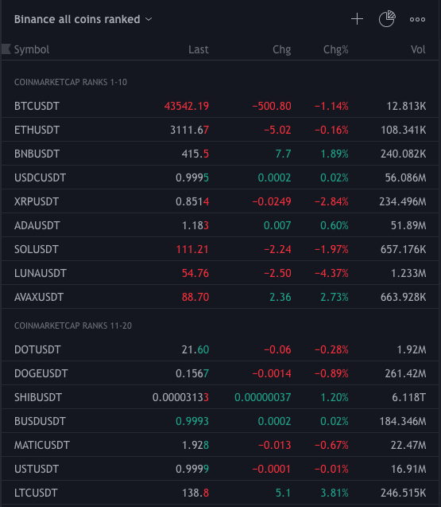

# TradingView watchlist generator

A simple Node.js application for generating watchlists that can be imported to TradingView. The watchlists contain a list of tradable coin pairs for spot trade with USDT in Binance.

Feel free to fork and modify to whatever you need. ;)

